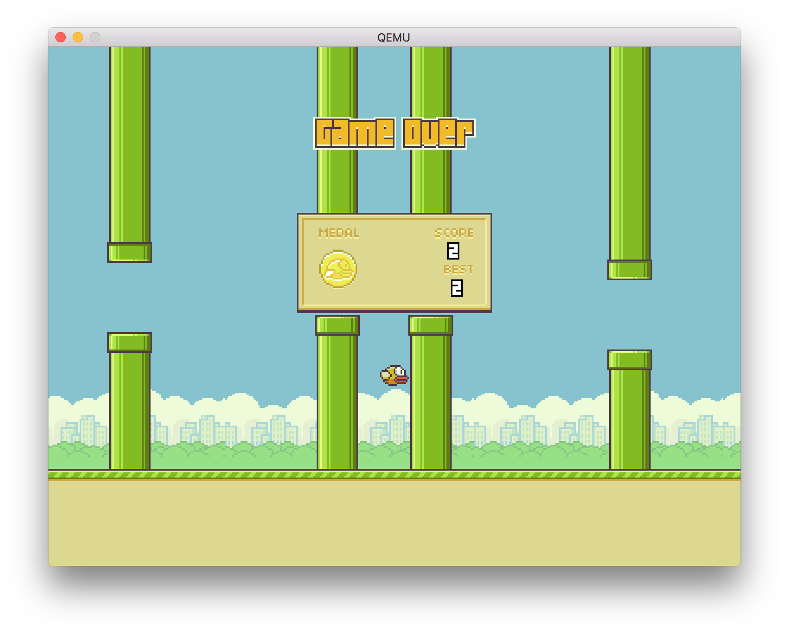

# boot2flappy
Flappy Bird for UEFI written in x86 Assembly.



## Getting the source
Download the source code by running the following code in your command prompt:
```sh
$ git clone https://github.com/fabianishere/boot2flappy.git
```
or simply [grab](https://github.com/fabianishere/boot2flappy/archive/master.zip) 
a copy of the source code as a Zip file.

## Building
Create the build directory.
```sh
$ mkdir build
$ cd build
```
boot2flappy requires CMake and a C cross-compiler (mingw-w64-x86-64) in order to build.
On Ubuntu, please install the following packages:

- binutils-mingw-w64 
- gcc-mingw-w64-x86-64

Then, simply create the Makefiles:
```sh
$ cmake ..
```
and finally, build it using the building system you chose (e.g. Make):
```sh
$ make
```

## Playing
After building the project, just run the following code in your command prompt:
```sh
$ vm/start.sh
```
This will start a Qemu virtual machine in which you can play the game.

## Why
One of the assignments for the Computer Organisation course of 2016 at Delft University of Technology
was to create a bootable game in x86 assembly. To see the other assignments I made,
take a look at the [ti1406](https://github.com/fabianishere/ti1406) repository.

## License
The code is released under the MIT license. See the `LICENSE` file.

All sprite files in the `resources` directory: all copyrights belong to their 
respective owners. The files are used for education purpose only.
